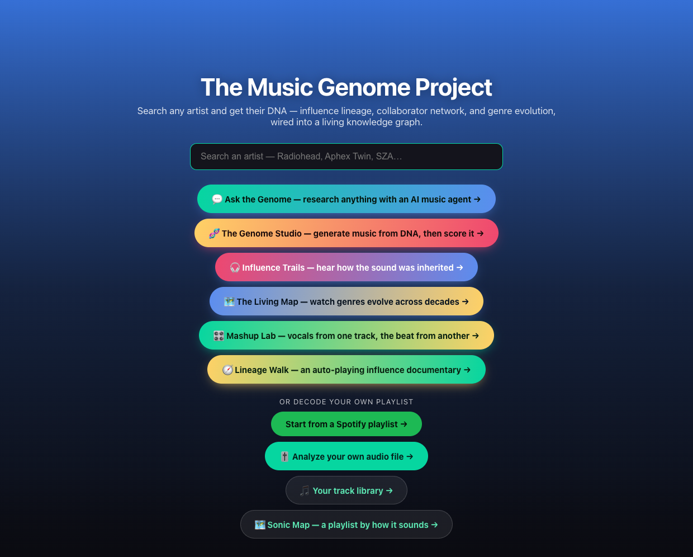
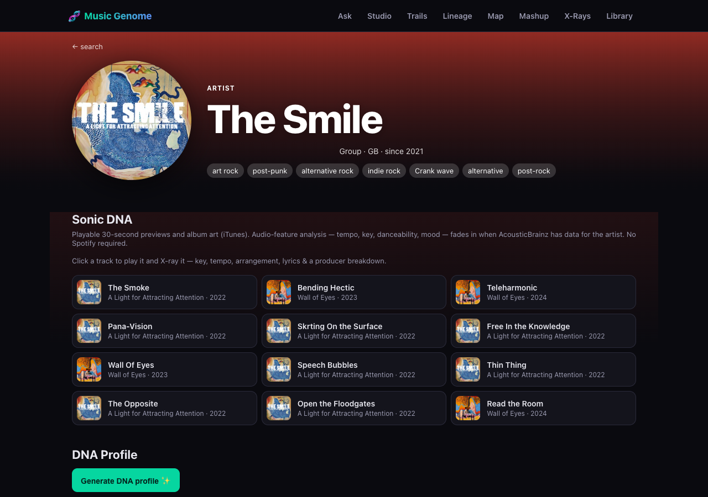
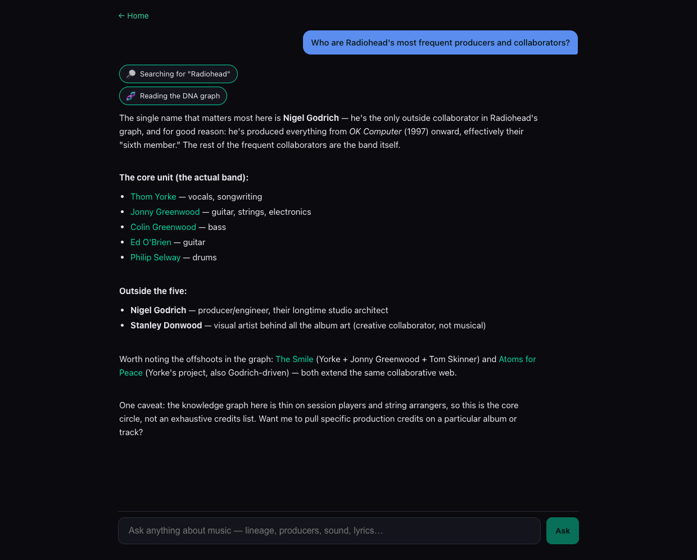
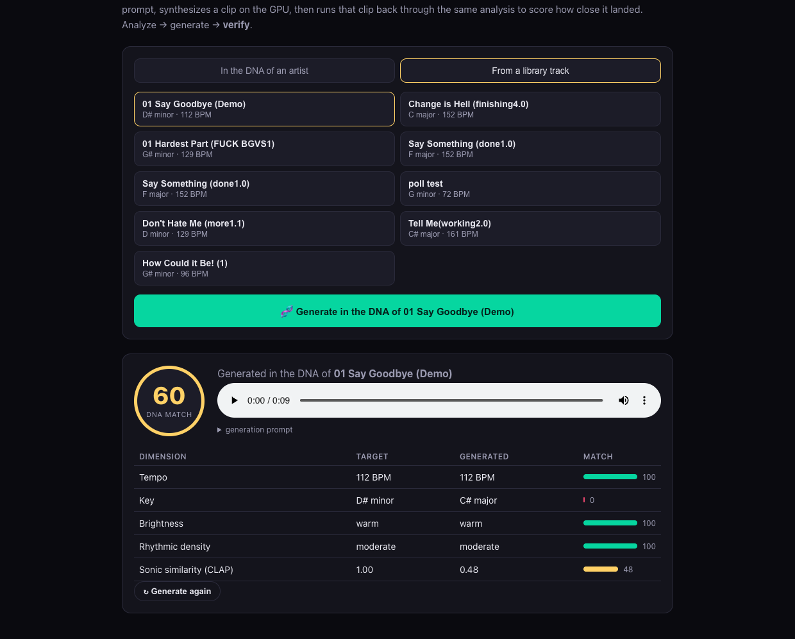
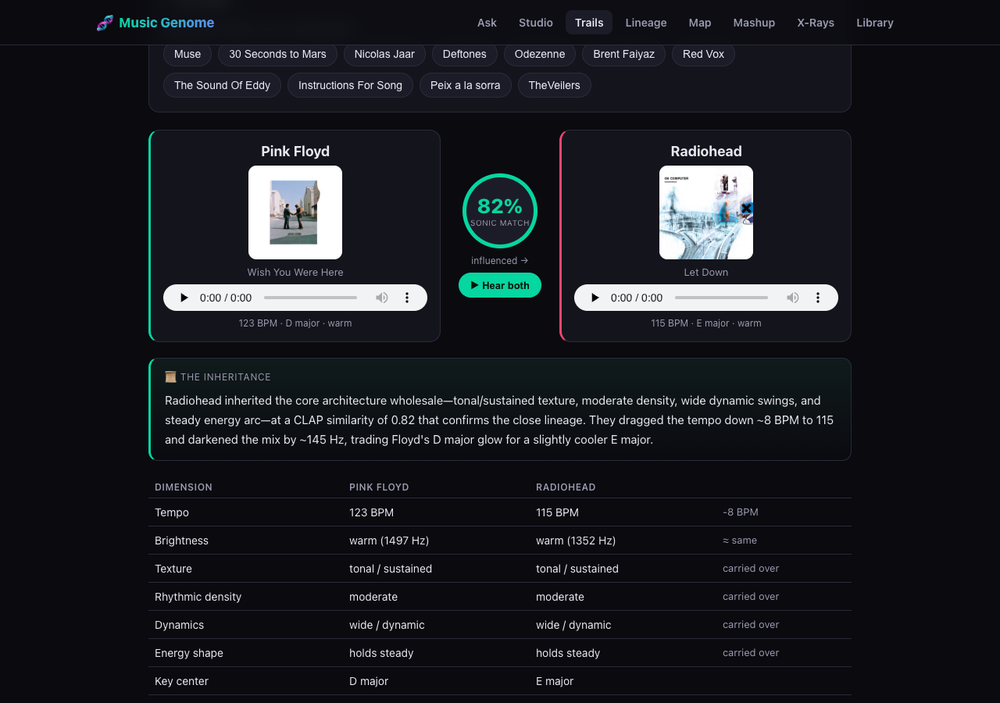
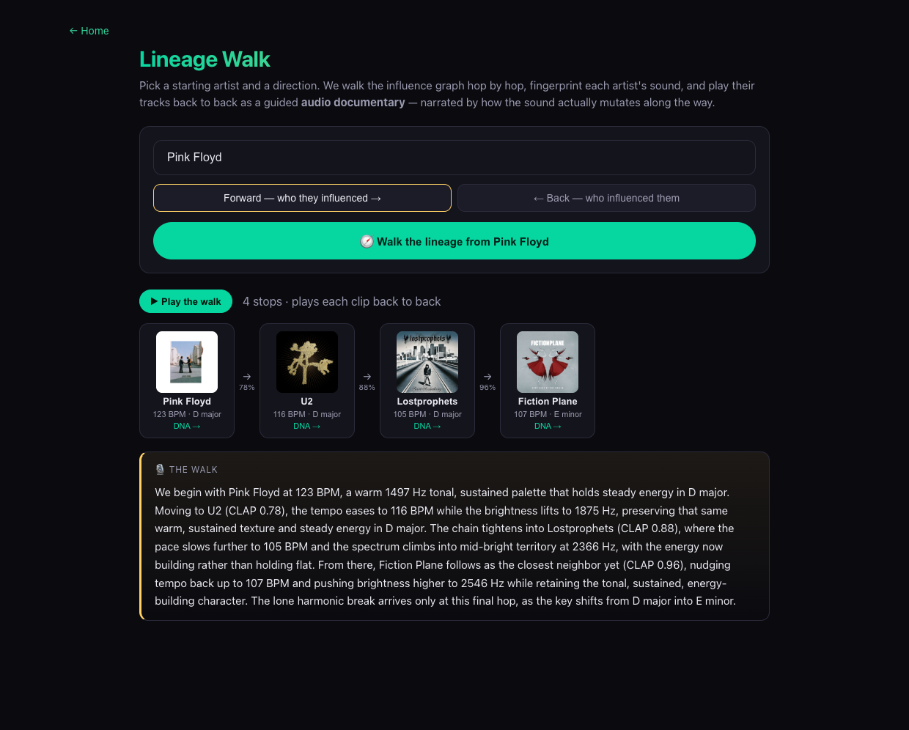
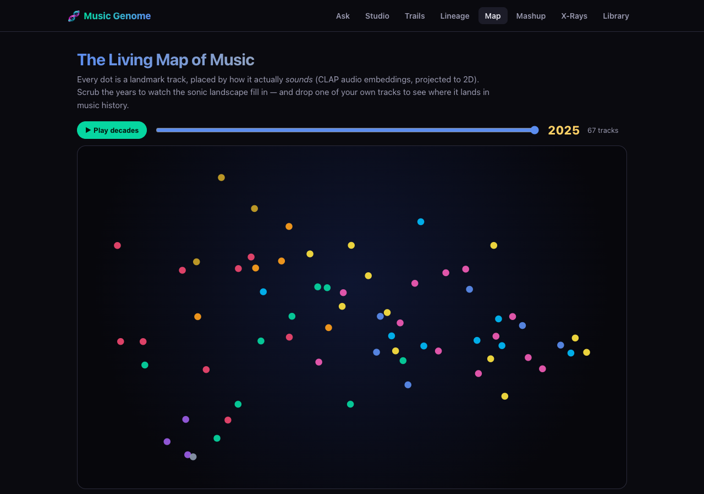
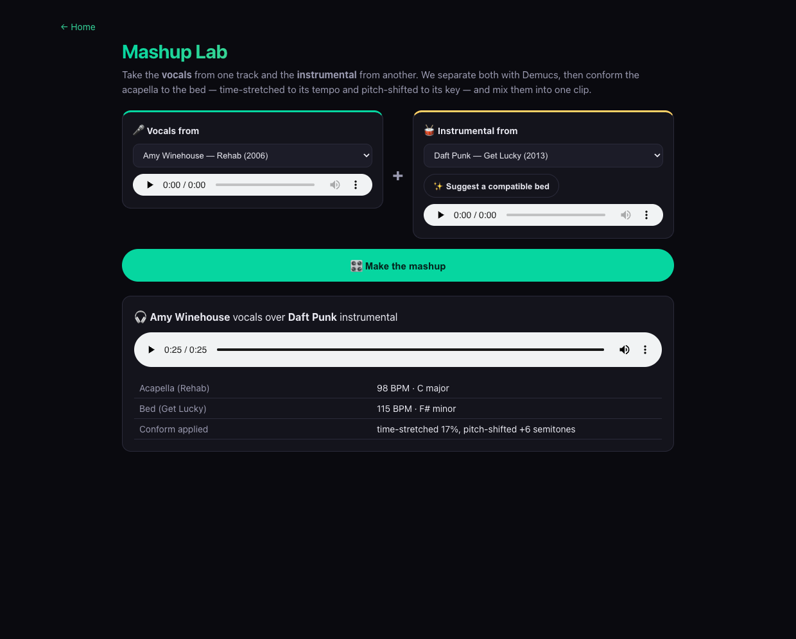

# 🧬 The Music Genome Project

A music‑intelligence platform that treats songs and artists as **measurable, multimodal data** — a knowledge graph of influence and collaboration, fused with real audio analysis (DSP + CLAP embeddings + source separation) and an LLM layer — and turns that into things a streaming service can't do: generate music in an artist's DNA and grade it, *hear* the family tree, mash two songs together in key and tempo, and watch genres evolve across a sonic map of history.



> **Why build it on open data?** Spotify deprecated its audio‑features, related‑artists, and recommendations APIs for new apps on 2024‑11‑27. So the "intelligence" here comes from sources that are actually open — **MusicBrainz, Wikidata, Last.fm, iTunes, Genius, AcousticBrainz** — plus audio that the app analyzes itself from 30‑second previews and user uploads.

It runs entirely on **Google Cloud** (Cloud Run, Firestore, GCS, Secret Manager) and is deployed as a private, password‑gated preview.

---

## Table of contents

- [Architecture](#architecture)
- [Feature tour (with screenshots)](#feature-tour)
- [The audio & AI backbone](#the-audio--ai-backbone)
- [Data sources](#data-sources)
- [Tech stack](#tech-stack)
- [Repository layout](#repository-layout)
- [Local development](#local-development)
- [Deployment](#deployment)
- [Notes & limitations](#notes--limitations)

---

## Architecture

```
                                  ┌──────────────────────────────────────────┐
  Browser ──────────────────────▶ │  web  (Next.js 15 / React 19 / TS)        │
   (password-gated)               │  Cloud Run · public                       │
                                  └───┬───────────────┬──────────────┬────────┘
                                      │               │              │
              ┌───────────────────────┘               │              └─────────────┐
              ▼                                        ▼                            ▼
   ┌──────────────────────┐         ┌───────────────────────────┐      ┌────────────────────────┐
   │ Open data APIs        │        │ audio-service (FastAPI)    │      │ Firestore · GCS         │
   │ MusicBrainz · Wikidata│        │ Cloud Run · CPU            │      │ reports, uploads,       │
   │ Last.fm · iTunes ·    │        │ librosa · Demucs · CLAP ·  │      │ artist fingerprints,    │
   │ Genius · AcousticBrainz│       │ Essentia · Whisper ·       │      │ CLAP vectors · audio    │
   └──────────────────────┘         │ Rubber Band                │      └────────────────────────┘
                                     └───────┬───────────┬────────┘
        ┌──────────────────────────────┐    │           │     ┌──────────────────────────────┐
        │ Anthropic Claude (opus-4-8)  │◀───┘           └───▶ │ GPU services · Cloud Run · L4 │
        │ narratives + agentic tool use│                      │ musicgen · audio-flamingo     │
        └──────────────────────────────┘                      └──────────────────────────────┘
```

- **`web`** — the Next.js App Router app (the whole UI + API routes). Stores assembled artist reports, uploads, and per‑artist sonic fingerprints in **Firestore**; audio in **GCS**; secrets in **Secret Manager**.
- **`audio-service`** — a Python FastAPI sidecar that does the heavy DSP: tempo/key/chords (librosa), source separation (Demucs), CLAP audio/text embeddings, discriminative tagging (Essentia), transcription (faster‑whisper), and time‑stretch/pitch‑shift (Rubber Band). Private (IAM‑gated); the web app calls it with a signed identity token.
- **GPU services** — two scale‑to‑zero NVIDIA **L4** Cloud Run services: **MusicGen** (generation) and **Audio Flamingo** (an audio‑LLM that describes a clip like a producer would).
- **Anthropic Claude** (`claude-opus-4-8`) powers every prose/narration surface and the agentic chat's tool‑use loop.

> 📐 For a deeper technical write‑up — request lifecycles, the Firestore data model, service‑to‑service auth, caching, and the design decisions/tradeoffs — see **[docs/ARCHITECTURE.md](docs/ARCHITECTURE.md)**.

---

## Feature tour

### 🧬 Artist DNA Report
Search any artist and get a living report: a directional **influence family tree** (Wikidata P737), a **collaborator/producer network** (MusicBrainz relations), a **genre‑evolution timeline**, an LLM **DNA profile**, and **Sonic DNA** — playable 30‑second previews with measured audio features (tempo, key, danceability, mood) from iTunes + AcousticBrainz. Every node is clickable to dive into that artist.



### 💬 Ask the Genome
An **agentic research chat**: Claude is given tools over the whole stack — search the graph, read an artist's DNA, pull the iTunes catalog, search by sound (CLAP), inspect a track's DSP, fetch Genius credits/lyrics — and plans multi‑step queries no search box can answer. The agent's tool calls stream live, and it cites artists with clickable links back into their DNA report.



### 🎛️ The Genome Studio — analyze → generate → verify
Pick an artist or a library track; the Studio reads its **measured DNA**, assembles a prompt, generates a clip on the **MusicGen** GPU, then **runs that clip back through the same analysis pipeline** and scores how close it landed — tempo, key, brightness, and **CLAP cosine similarity** to the source — as a weighted "DNA match." Closing the generate→**verify** loop is the differentiator: generation treated as an engineering problem with ground truth.



### 🎧 Audible Influence Trails
Pick an artist, pick someone in their family tree, and **hear + measure** the inheritance: CLAP similarity between the two catalogs, concrete DSP deltas (tempo, brightness in Hz, texture, key), an LLM narration grounded entirely in those numbers, and paired previews to A/B.



### 🧭 Lineage Walk
The multi‑hop version: walk the influence graph forward (descendants) or back (influences), fingerprint each artist, and play their tracks back‑to‑back as a **guided audio documentary** — narrated by how the sound mutates along the chain, with per‑hop similarity scores.



### 🗺️ The Living Map of Music
A **time‑lapse genre atlas**: ~70 landmark tracks (1950s–2020s) embedded with CLAP and projected to 2D — every dot placed by how it actually *sounds*. Scrub the years to watch the landscape fill in, click a dot to hear it, and **drop one of your own tracks** onto the map to see which eras and artists it lands nearest.



### 🎚️ Mashup Lab
Take the **vocals** from one track and the **instrumental** from another. Demucs separates both, then the acapella is **conformed to the bed** — time‑stretched to its tempo and pitch‑shifted to its key (via **Rubber Band**) — and mixed into one clip. A CLAP‑based matcher suggests sonically compatible beds.



### …plus the rest of the platform
- **Song X‑Ray** — per‑track DSP + the Audio Flamingo read + Genius credits/lyrics, synthesized into a Grammy‑producer‑style breakdown.
- **Stem Lab** — Demucs solo/mute player with per‑stem analysis and karaoke timing.
- **Upload & analyze your own audio** — full‑song DSP, CLAP embedding, and a producer breakdown, saved to a personal library.
- **Sonic Map** — a playlist laid out by how it sounds (UMAP of CLAP vectors) with natural‑language "search by sound."
- **Spotify playlist decoder** — load any playlist and X‑ray every track (OAuth; works around Spotify's deprecated audio APIs).

---

## The audio & AI backbone

A few capabilities are reused everywhere:

- **CLAP embeddings** (LAION `clap-htsat-unfused`) — a shared 512‑dim text+audio space. It powers search‑by‑sound, "sonic twins," the Influence Trails / Lineage similarity scores, the Living Map projection, the Mashup matcher, and the Genome Studio's verify step.
- **DSP** (librosa) — tempo, key (Krumhansl), chord progression, brightness, texture, density, dynamics, energy arc — the measured "ground truth" used in reports, trails, and the Studio scorecard.
- **Source separation** (Demucs `htdemucs`) — vocals/drums/bass/other for the Stem Lab and Mashup Lab.
- **Generation** (Meta MusicGen, GPU) — the Studio's generative half.
- **Audio understanding** (NVIDIA Audio Flamingo, GPU) — a musician‑level description of a clip, fed into the Song X‑Ray critique.
- **LLM** (Anthropic Claude `claude-opus-4-8`) — DNA narratives, trail/lineage narration, producer breakdowns, and the agentic tool‑use loop behind Ask the Genome. Falls back to local Ollama when no key is set.

The **analyze → generate → verify** loop and the **agentic tool surface** are the two architectural ideas the platform is built to show off.

---

## Data sources

| Layer | Source |
|---|---|
| Influence family tree (directional) | **Wikidata** P737 "influenced by" (SPARQL) |
| Collaborator / member / producer network | **MusicBrainz** artist relations |
| Sonic neighbors + tags | **Last.fm** similar artists / top tags |
| Genre‑evolution timeline | **MusicBrainz** release‑groups + genres |
| Playable previews + album art | **iTunes** Search API (no key, 30s previews) |
| Crowd‑sourced audio features | **AcousticBrainz** |
| Song credits + lyrics | **Genius** (+ lrclib fallback) |
| All measured audio (DSP, CLAP, stems, gen) | the **audio-service** (analyzed from previews/uploads) |

---

## Tech stack

**Web:** Next.js 15 (App Router) · React 19 · TypeScript · `react-force-graph-2d` · `@anthropic-ai/sdk` · `@google-cloud/firestore` · `@google-cloud/storage`
**Audio‑service:** Python · FastAPI · librosa · Demucs (PyTorch) · 🤗 Transformers (CLAP, MusicGen, Audio Flamingo) · Essentia‑TensorFlow · faster‑whisper · Rubber Band (`pyrubberband`)
**AI:** Anthropic Claude `claude-opus-4-8` (prose + agentic tool use); MusicGen + Audio Flamingo on GPU
**Cloud (GCP):** Cloud Run (web + audio + 2 GPU services) · Firestore (Native) · Cloud Storage · Secret Manager · Artifact Registry · Cloud Build

---

## Repository layout

```
src/
  app/
    page.tsx                  home hub
    artist/[mbid]/            the DNA report
    ask/  studio/  trail/     agentic chat · generate→verify · influence trails
    lineage/  atlas/  mashup/ lineage walk · living map · mashup lab
    upload/ library/ map/     uploads · library · sonic map
    playlists/ playlist/[id]/ Spotify decoder
    api/                      one route per capability (search, artist, ask,
                              studio/generate, trail, lineage, atlas/place,
                              mashup, track/*, uploads/*, spotify/*, cron/*)
  lib/                        musicbrainz · wikidata · lastfm · itunes · genius
                              · acousticbrainz · store (Firestore) · storage (GCS)
                              · llm · ingest · trail · genomePrompt · musicgen · …
  components/                 Graph · SonicDna · SongXray · StemLab · AskGenome ·
                              GenomeStudio · InfluenceTrail · LineageWalk ·
                              AtlasMap · MashupLab · …
  data/musicMapEmbeddings.json   baked Living-Map corpus vectors (server-side)
audio-service/                FastAPI app: main.py · stems.py · mashup.py ·
                              flamingo.py · tagger.py · clap.py + Dockerfiles
musicgen-service/             MusicGen GPU service
scripts/build-music-map.ts    one-off Living-Map corpus builder
deploy/                       deploy.sh + Cloud Build configs + push-secrets.sh
public/music-map.json         baked Living-Map points (client)
```

---

## Local development

```bash
cp .env.local.example .env.local     # fill in keys (see below)
npm install
npm run dev                          # http://localhost:3000
```

**Minimum to be useful:** a `MUSICBRAINZ_USER_AGENT` with a real contact, and either a local **Ollama** (`ollama pull qwen2.5:14b`) or `ANTHROPIC_API_KEY` for prose. A **Last.fm** key (free, instant) fills in sonic neighbors.

- The data store uses Firestore via Application Default Credentials — run `gcloud auth application-default login` (or point `FIRESTORE_EMULATOR_HOST` at the emulator).
- **Ask the Genome** requires `ANTHROPIC_API_KEY` regardless of `LLM_PROVIDER` (local Ollama can't do reliable tool use).
- The audio‑heavy features (Sonic DNA, Song X‑Ray, Stem Lab, Studio, Trails, Lineage, Atlas, Mashup) need the **audio‑service** running and reachable via `AUDIO_SERVICE_URL`, plus `MUSICGEN_URL` for the Studio. See `audio-service/README.md`.

See `.env.local.example` for the full, commented list of variables.

---

## Deployment

Everything is one command (Cloud Run, scale‑to‑zero):

```bash
PROJECT=your-gcp-project-id ./deploy/push-secrets.sh   # API keys + login gate → Secret Manager
PROJECT=your-gcp-project-id ./deploy/deploy.sh         # builds + deploys all services
```

`deploy.sh` enables the APIs, creates Firestore + Artifact Registry, builds the four images (web, audio, flamingo, musicgen) via Cloud Build, and deploys:

| Service | Runtime | Access |
|---|---|---|
| `web` | Cloud Run (1 vCPU) | public, password‑gated |
| `audio-service` | Cloud Run (4 vCPU CPU) | private (IAM) |
| `musicgen` | Cloud Run + NVIDIA **L4** | private (IAM), scale‑to‑zero |
| `flamingo` / `flamingo-afnext` | Cloud Run + NVIDIA **L4** | private (IAM), scale‑to‑zero |

Data lives in Firestore + GCS; secrets in Secret Manager; the web service calls the private services with Google‑signed identity tokens.

To (re)build the Living‑Map corpus: `npx tsx scripts/build-music-map.ts` against an audio‑service that exposes CLAP embeddings.

---

## Notes & limitations

- **Cold starts.** The audio + GPU services scale to zero, so the *first* generation / mashup / trail after idle is slow (a GPU spins up, a model loads, Demucs runs). Warm runs are fast; analyses are cached (per preview URL, and per‑artist fingerprints in Firestore). Warm the services before a live demo.
- **Tempo octave errors.** Beat tracking occasionally reports half/double time on some tracks — handled tolerantly in the scorecards, but visible in raw readouts.
- **Generation quality.** The Studio uses `musicgen-small` for fast, reliable iteration; swap `MUSICGEN_MODEL` for a larger model for higher fidelity. Mashup conform uses Rubber Band for clean stretch/shift.
- **Private preview.** The deployment is password‑gated and this repository is private.

---

*Built as a portfolio demo of multimodal music intelligence — agentic tool use over a proprietary data layer, audio embeddings + DSP, and a generate‑then‑verify loop, all running on GCP.*
